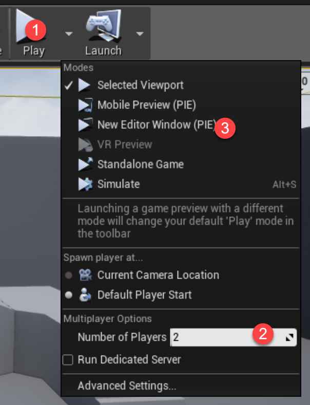
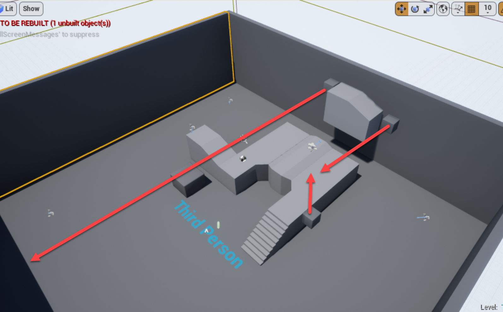
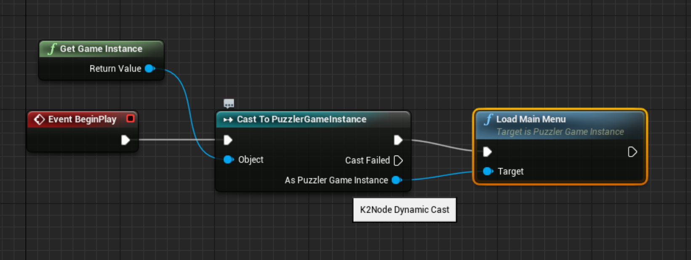
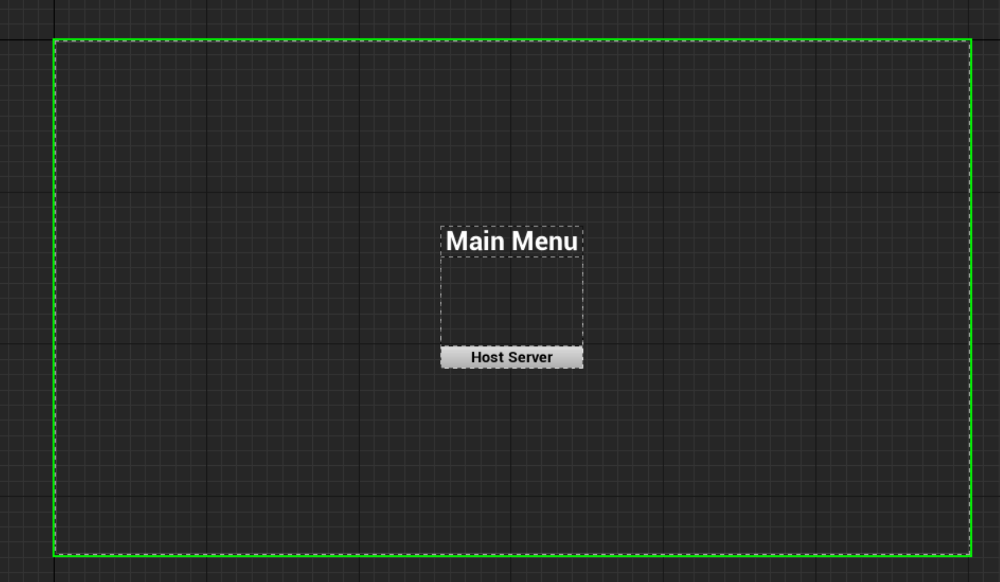
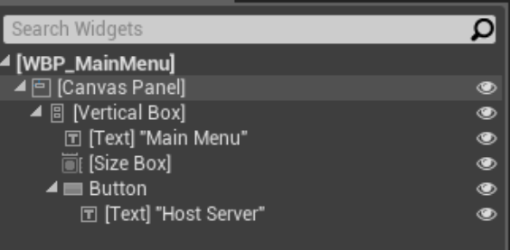

## Connecting Two Players

1. Create a 3rd person game

 

2. Play as two (or more) Players

 

3. Add more player starts

 

4. Need to add many to avoid clash probability

## Introducing the Client-Server model

1. Launch a game standalone:

 ```
 & "C:\Program Files\UE_4.16\Engine\Binaries\Win64\UE4Editor.exe" "C:\...\Puzzler\Puzzler.uproject" -game -log
 ```
2. Just run a dedicated server:

  ```
 & "C:\Program Files\UE_4.16\Engine\Binaries\Win64\UE4Editor.exe" "C:\...\Puzzler\Puzzler.uproject" /Game/ThirdPersonCPP/Maps/ThirdPersonExampleMap -server -log
 ```

3. Note what happens with a bad path.

4. Find you IP then launch:

 ```
 & "C:\Program Files\UE_4.16\Engine\Binaries\Win64\UE4Editor.exe" "C:\...\Puzzler\Puzzler.uproject" 192.168.1.90 -game -log
 ```

## Detecting Where The Code is Running

1. Create a StaticMesh actor.
2. Add movement logic (including mobility)
3. Only run with authority.

## Authority and Replication

1. Explain the authority and replication model.
1. Enable replication of movement.
2. Notice what happens when we only make change to client.
3. Explain the behaviour when client stands on the platform.

## Aside: Faster Build Times

1. Explain symbols, headers and linkers
2. How modules are just a DLL system.
2. Remove by process of elimination.

## Revision: Adding Vectors and Normalisation

1. Editable widget.
2. Revision of Vectors.
3. Direction and normalisation challenge.

## Revision: Vector Dot Products

1. What is a dot product.
2. Create the scheme.
3. Implement and factor.

## Creating a Simple Platform Puzzle

1. Better level layout.

 
2. Tweak the jumping movement.

 

## Setup a Platform Trigger

1. Create the C++ base
2. Add box component.
3. Tweak in BP child.
4. Place in the world.

## Enable Triggering Callbacks

1. Show one trigger.
2. Challenge the other.

## Activating Platforms from Triggers

1. Overview the desired behaviour
1. Create an activation int.
3. Create TArray for platforms.
4. For loop on trigger.

## When to use a GameInstance

1. Create derived class.
2. Set as game instance for project.
 
2. If not working, restart the editor.
3. Investigate difference between init and constructor.
4. Answer: Init not in editor.

## Accessing UI Classes in C++

1. Create a widget.
2. Reference the class in Constructor.
3. Include `UMG` module. Must rebuild VS proj.
3. Ensure we have the right class in init.

## Load and Display UI in C++

1. Create a `UFUNCTION` on the GI.
2. Call it from the level BP for now.
 
3. Print the string.
4. Create and attach to viewports

## Changing Input Modes in C++

(Steps shown in code.)

## Advanced UMG layout

1. What we want to achieve

 
1. Using vertical boxes (and containers generally)
2. Size boxes for auto padding.
3. Create menu level.
4. Challenge for UI creation, eventual solution:

 

## Connecting UMG to C++

1. Create a `UUserWidget` C++ class.
2. Add bind widget.
2. Reparent the BP.

 
3. Check errors.

 

## Calling C++ Functions from UMG Buttons

1. Add initializer.
2. Add callback.

## Hosting with `ServerTravel()`

1. Explain basic concept of travel: all focused around maps and gamemodes.
1. Get the game instance.
2. Call a host server function.
3. `ServerTravel` to correct map.

## Disabling the Menu

1. Keep track of current menu.
2. Invert steps.
9. Don't forget to not load on new level.

## Navigating to Submenus

1. Join server button and callback.
2. Load join server menu function on GI.
3. Factor out `ShowMenu` and `HideMenu`.
4. Create a Join menu class like this:

 
5. NB: Use an editable text box and scale the font.

## Accessing Text Properties

1. How to access from a text property.
1. Create parent class for the menu.
2. Reparent.
3. Print out the text field.

## Joining a Server with `ClientTravel()`

1. What is ClientTravel.
1. Expose public function from GI.
2. Call from there.
3. Set default game map.
3. Open two games to test.

## Displaying Error Messages

1. Text block in menu
2. Create error getter in GI.
3. Set the text in the textblock.

## Intercepting Travel Errors

1. Listening delegate.
2. Hook up to the UI.
